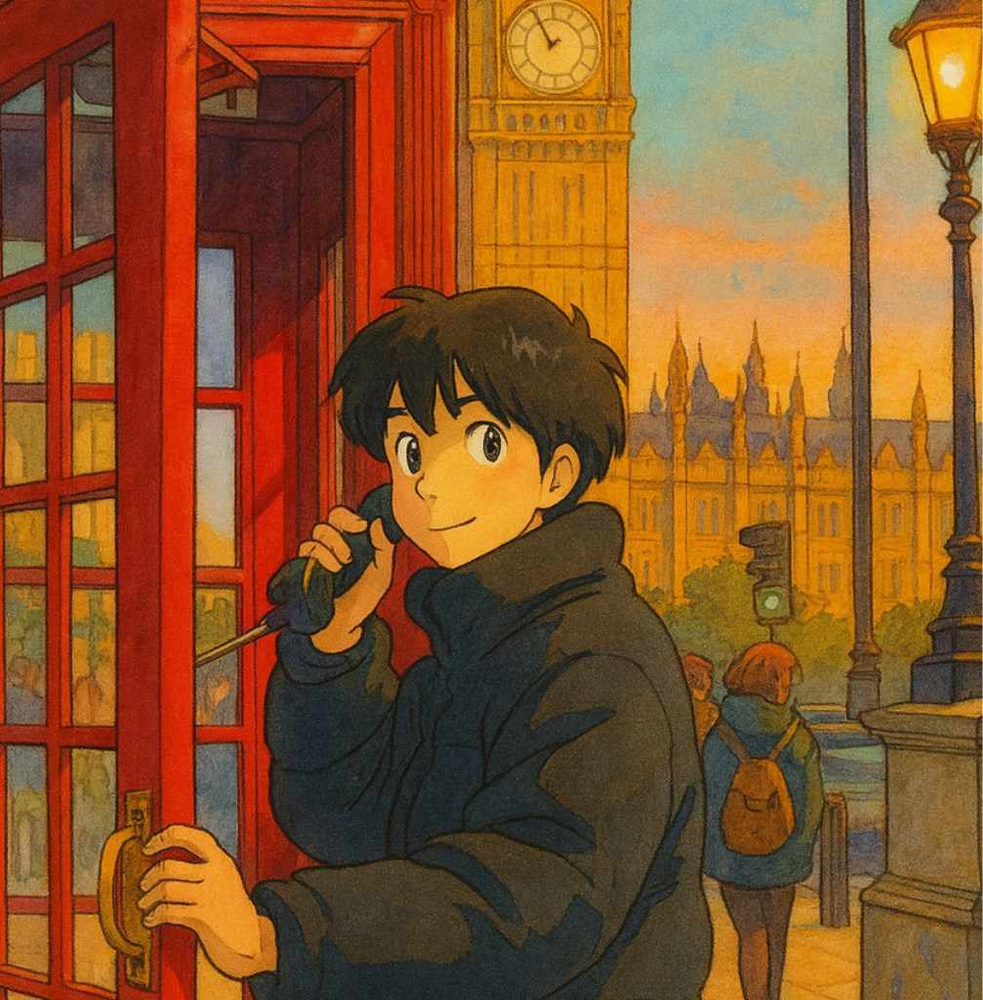

<h1 align="center">
  こんにちは 👋 修士1年の岡田です 📷
</h1>

<h3 align="center">
  情報系専攻の大学院生です。
</h3>

  

  <!-- プロフィール閲覧数とHPバッジ -->
  
  

---

- 🔬 **Vision & Language（画像×言語）** を用いたAIの研究に取り組んでいます。
- 🌱 **Python・機械学習・画像処理・自然言語処理** を学習中。
- 🗺️ 趣味は **写真撮影** と **旅行**。
- 📫 連絡先：
  [📁 ポートフォリオサイト](https://otake-code.github.io/) ｜ [💼 就職用メール](mailto:okdw24@gmail.com) ｜ [🎓 大学用メール](mailto:okada@cv.info.gifu-u.ac.jp)
- 📝 ハッカソン・学会発表などで活動しています。

---

<h3 align="center">
  🧠 My Skills
</h3>

<h4 align="center">Programming Languages</h4>

  

<h4 align="center">Frameworks and Libraries</h4>

  

<h4 align="center">Databases and Development Tools</h4>

  

---

<h3 align="center">
  📊 GitHub Stats
</h3>

  

---

  ご覧いただきありがとうございます！ 
  AI・写真に興味がある方、ぜひ交流しましょう。

